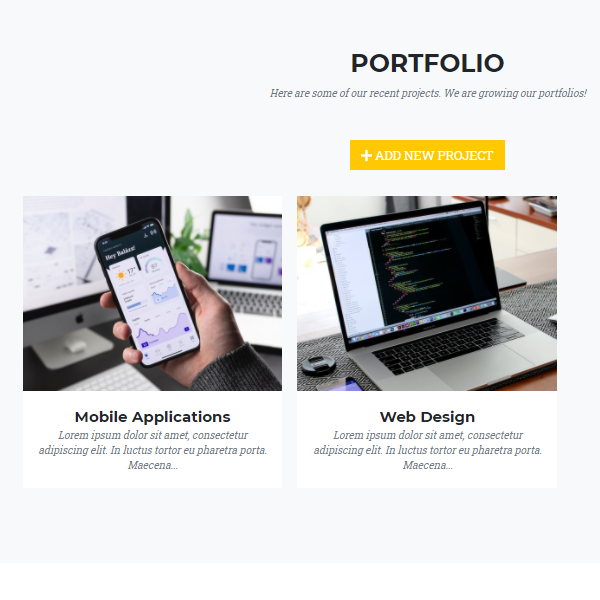
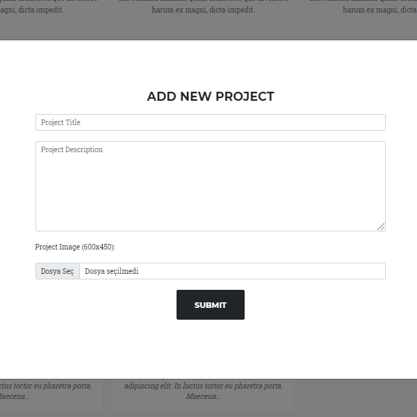
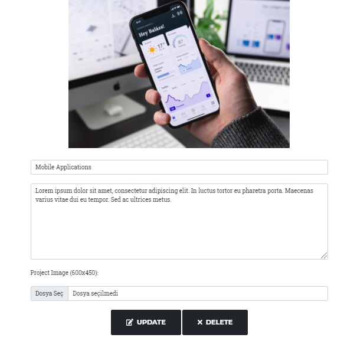

# Agency (Node.js)

Agency simple and single web app for kickstart to Node.js. (Express, EJS, Mongoose)
#### Usage:

clone and run `npm i` && `npm start`

#### Heroku:

https://agency-portfolio-app.herokuapp.com/

|                                |                                                |                                                |
| :--------------------------------------------------------------------------------------------------------------------------------------------------------------------------: | :---------------------------------------------------------------------------------------------------------------------------------------------------------------------: | :---------------------------------------------------------------------------------------------------------------------------------------------------------------------: |
|  |  |  |  |

#### Useful Links:

https://nodejs.org/en/  
https://www.npmjs.com/package/express  
https://www.npmjs.com/package/mongoose
